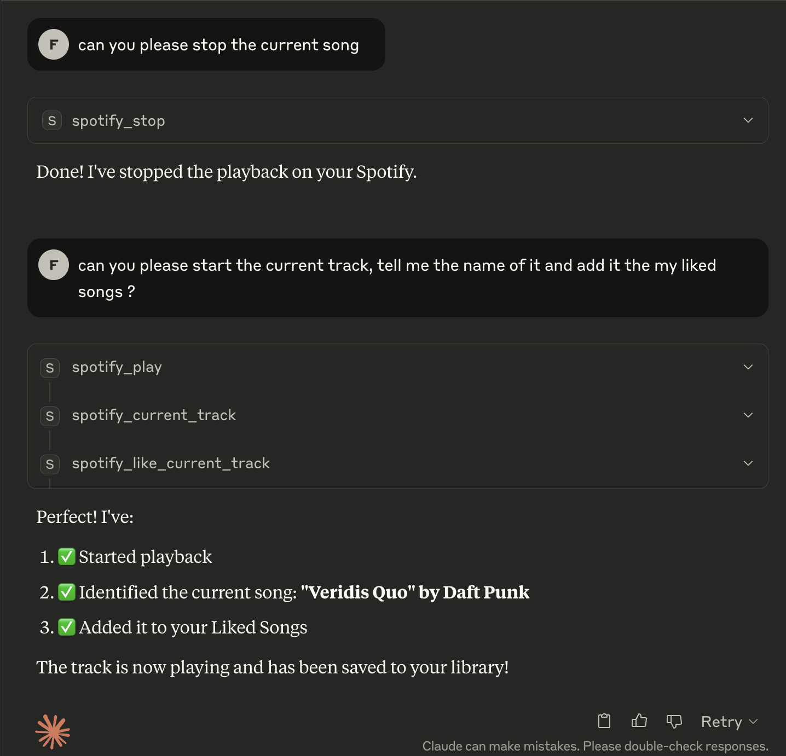

# Spotify MCP Server

A simple MCP server to control Spotify playback and manage your liked songs via LLM's.

## Features

- Play and pause Spotify playback
- Get info about the current track
- Add the current track to your Liked Songs

## Setup

1. **Clone the repository:**
   ```sh
   git clone https://github.com/yourusername/spotify-mcp-server.git
   cd spotify-mcp-server
   ```

2. **Create and activate a virtual environment:**
   ```sh
   python3 -m venv .venv
   source .venv/bin/activate
   ```

3. **Install dependencies:**
   ```sh
   pip install uv
   uv pip install -r uv.lock
   ```

4. **Create a `.env` file:**
   ```
   SPOTIPY_CLIENT_ID=your_spotify_client_id
   SPOTIPY_CLIENT_SECRET=your_spotify_client_secret
   SPOTIPY_REDIRECT_URI=http://localhost:8888/callback
   ```

5. **Run the server:**
   ```sh
   python main.py
   ```

## Integration with Claude (MCP Server)

To use this server as an MCP server with Claude, add the following entry to your Claude config file (usually located at `~/Library/Application Support/Claude/claude_desktop_config.json` on macOS):

```json
{
  "mcpServers": {
    "spotify-mcp-server": {
      "command": "uv",
      "args": [
        "--directory",
        "/ABSOLUTE/PATH/TO/PROJECT/spotify-mcp-server",
        "run",
        "main.py"
      ]
    }
  }
}
```

- Replace `/ABSOLUTE/PATH/TO/PROJECT/spotify-mcp-server` with the actual path to your project
- Make sure your environment variables are set either in the config or via a `.env` file.
- Restart Claude after editing the config file.

## Notes

- You need to register your app at the [Spotify Developer Dashboard](https://developer.spotify.com/dashboard/) to get your client ID and secret.

## Example Session

Below is an example session using Claude with the Spotify MCP server:



**Sample interaction:**

```
User: Play the current track using Spotify MCP server
Claude: Playback started successfully

User: What song is playing?
Claude: Currently playing: Shape of You by Ed Sheeran

User: Like this song
Claude: Added 'Shape of You' to your Liked Songs.
```
